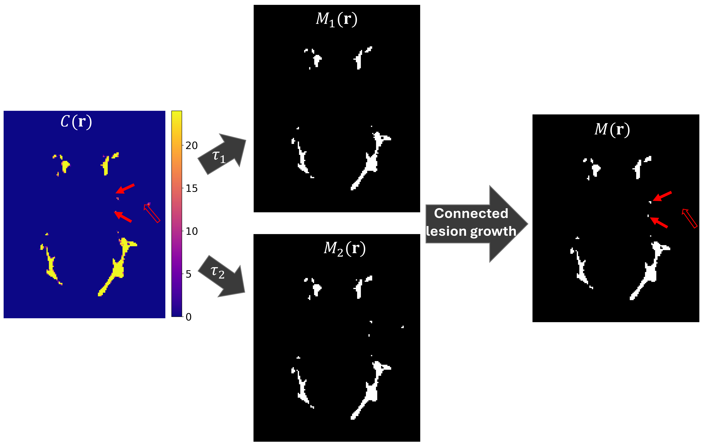
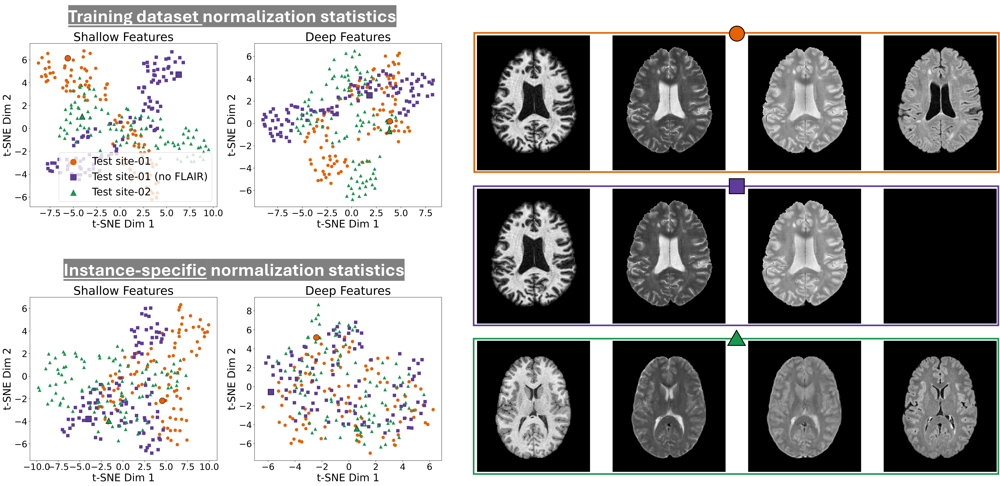

# UNISELF: A Unified Network with Instance Normalization and Self-Ensembled Lesion Fusion for Multiple Sclerosis Lesion Segmentation  
| Medical Image Analysis (2026)

UNISELF is a deep learning framework for **robust multiple sclerosis (MS) lesion segmentation**
designed to achieve **high in-domain accuracy** while maintaining **strong out-of-domain
generalization** under domain shifts and missing input contrasts.

UNISELF was developed to address real-world clinical challenges in MS imaging, including
scanner and protocol variability, acquisition artifacts, and incomplete MRI contrasts
(e.g., missing FLAIR), **without requiring domain labels or retraining**.

---

## Publication and Citation

### Publications

Zhang et al.,  
**UNISELF: A Unified Network with Instance Normalization and Self-Ensembled Lesion Fusion for Multiple Sclerosis Lesion Segmentation**,  
*Medical Image Analysis*, 2026.

Zhang et al.,  
**Towards an Accurate and Generalizable Multiple Sclerosis Lesion Segmentation Model Using Self-Ensembled Lesion Fusion**,  
*IEEE International Symposium on Biomedical Imaging*, 2024.

### Citation
```bibtex
@article{zhang2026uniself,
  title   = {UNISELF: A Unified Network with Instance Normalization and Self-Ensembled Lesion Fusion for Multiple Sclerosis Lesion Segmentation},
  author  = {Zhang, Jinwei and Zuo, Lianrui and Dewey, Blake E. and Remedios, Samuel W. and Liu, Yihao and Hays, Savannah P. and Pham, Dzung L. and Mowry, Ellen M. and Newsome, Scott D. and Calabresi, Peter A. and Saidha, Shiv and Carass, Aaron and Prince, Jerry L.},
  journal = {Medical Image Analysis},
  year    = {2026}
}
@inproceedings{zhang2024towards,
  title={Towards an accurate and generalizable multiple sclerosis lesion segmentation model using self-ensembled lesion fusion},
  author={Zhang, Jinwei and Zuo, Lianrui and Dewey, Blake E and Remedios, Samuel W and Pham, Dzung L and Carass, Aaron and Prince, Jerry L},
  booktitle={2024 IEEE International Symposium on Biomedical Imaging (ISBI)},
  pages={1--5},
  year={2024},
  organization={IEEE}
}
```

---

## 1. Introduction

Accurate segmentation of MS lesions is a fundamental step for lesion volume quantification,
longitudinal lesion tracking, and extraction of lesion-specific biomarkers.
However, existing deep learning methods often suffer from poor generalization when applied
to out-of-domain data due to:

- Scanner and protocol variability
- Acquisition artifacts
- Missing or inconsistent input contrasts
- Limited training data from a single source domain

UNISELF addresses these challenges by combining **test-time self-ensembled lesion fusion (SELF)**
and **test-time instance normalization (TTIN)** to improve robustness under domain shifts.

---

## 2. Method Overview

UNISELF targets robust MS lesion segmentation under **domain shift** (multi-site/protocol differences) and **missing contrasts**. Trained on limited single-site data, it combines a 2.5D backbone with two **test-time** modules: **SELF** and **TTIN**.

### 2.1 Training Stage: 2.5D U-Net + augmentations + contrast dropout

- **Backbone**: a **single 2.5D U-Net** processes 3D MRI slice-wise (three adjacent slices as input).
- **Multi-orientation augmentation**: random plane (axial/sagittal/coronal) with rotations and flips.
- **Contrast dropout (CD)**: randomly zero-out a subset of contrasts (T1w/T2w/PDw/FLAIR) to simulate **all missing-contrast combinations**.

### 2.2 Self-Ensembled Lesion Fusion (SELF): detect + grow (not averaging)

At inference, UNISELF runs multi-orientation test-time augmentations and **does not** simply average predictions. Instead, it builds a voxel-wise **confidence map** $C(\mathbf{r})$ by summing binary masks across augmentations, then fuses results via:

- **Lesion detection**: high threshold $\tau_1$ to identify high-confidence lesion cores $(M_1(\mathbf{r}))$.
- **Connected lesion growth**: expand detected cores within candidates from a lower threshold $\tau_2$ $(M_2(\mathbf{r}))$ using 26-connectivity.



### 2.3 Test-Time Instance Normalization (TTIN): align latent features per input

TTIN reduces latent feature mismatches caused by **out-of-domain shifts** and **varying or missing contrasts** by computing normalization statistics **per test input** (batch size = 1), requiring **no retraining** or **domain labels**.



---

## 3. Preprocessing Requirements

Before running UNISELF, the following minimal preprocessing steps are required:

- Registration of multicontrast images to a common space (e.g., [MNI](https://www.bic.mni.mcgill.ca/ServicesAtlases/ICBM152NLin2009))
- Brain mask generation (e.g., using [HD-BET](https://github.com/MIC-DKFZ/HD-BET))

**Input format:** NIfTI (`.nii` or `.nii.gz`)


---

## 4. Installation

### 4.1 Install from source
```bash
conda create -n uniself_msseg python=3.8
conda activate uniself_msseg

git clone https://github.com/Jinwei1209/UNISELF.git
cd UNISELF
pip install .
```

This installs the following command-line tool:
- `uniself-msseg`

---

### 4.2 Network weights

- **Multi-site trained weights (recommended)**: [Download](https://zenodo.org/records/18189417/files/weights.pth?download=1)  
  Trained on a combination of public datasets including [ISBI 2015](https://www.sciencedirect.com/science/article/pii/S1053811916307819?via%3Dihub), [MICCAI 2016](https://www.nature.com/articles/s41598-018-31911-7), and [UMCL](https://link.springer.com/article/10.1007/s12021-017-9348-7), as well as an additional [private dataset](https://www.sciencedirect.com/science/article/pii/S2666956024000011#fig5).

- **ISBI challenge trained weights (for benchmarking purposes only)**: [Download](https://zenodo.org/records/18189721/files/weights_isbi.pth?download=1)  
  Trained exclusively on the public [ISBI 2015](https://www.sciencedirect.com/science/article/pii/S1053811916307819?via%3Dihub) dataset.

---


## 5. Inference

### 5.1 Example usage
```bash
uniself-msseg \
  --t1_path path/to/T1w.nii.gz \
  --t2_path path/to/T2w.nii.gz \
  --pd_path path/to/PDw.nii.gz \
  --t2flair_path path/to/FLAIR.nii.gz \
  --brain_mask_path path/to/brain_mask.nii.gz \
  --lesion_seg_path path/to/output_lesion_seg.nii.gz \
  --weight_path path/to/weights.pth \
  --gpu_id 0
```

### 5.2 Missing-contrast inference
```bash
uniself-msseg \
  --t1_path path/to/T1w.nii.gz \
  --t2_path path/to/T2w.nii.gz \
  --brain_mask_path path/to/brain_mask.nii.gz \
  --lesion_seg_path path/to/output_lesion_seg.nii.gz \
  --weight_path path/to/weights.pth \
  --gpu_id 0
```

### 5.3 Inference options
- `--t1_path`, `--t2_path`, `--pd_path`, `--t2flair_path`: input MRI contrasts (any subset supported)
- `--brain_mask_path`: input binary brain mask (required)
- `--lesion_seg_path`: output binary lesion mask (required)
- `--weight_path`: pretrained UNISELF weights (required)
- `--gpu_id`: GPU selection

---


## 6. License

This project is released for research use only.
Please cite the corresponding paper if you use UNISELF in your work.

---

## 7. Contact

**Jinwei Zhang**  
Johns Hopkins University  
Email: jwzhang@jhu.edu
